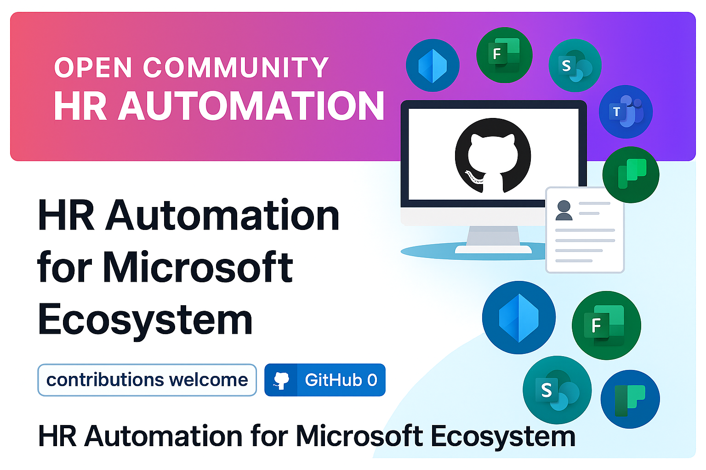

# 🚀 HR Automation for Microsoft Ecosystem

Welcome to the **HR Automation Community Resource**!  
This repository is designed to help IT and HR teams streamline **employee lifecycle processes** using the Microsoft 365 ecosystem.

---

## 📚 Table of Contents
- [🎯 Purpose](#-purpose)
- [✅ Features Included](#-features-included)
- [📁 Folder Structure](#-folder-structure)
- [🤝 Community Contribution](#-community-contribution)
- [📌 How to Get Started](#-how-to-get-started)
- [🏷️ Tags](#-tags)

---

## 🎯 **Purpose**

HR processes like onboarding and offboarding can be time-consuming and error-prone. This project provides **ready-to-use automation templates** built with:

- **Microsoft Forms**  
- **SharePoint**  
- **Power Automate**  
- **Planner**  
- **Microsoft Entra**  
- **Microsoft Teams**  

Our goal is to **simplify HR workflows**, improve compliance, and enhance the employee experience — all while leveraging tools you already have in Microsoft 365.

---

## ✅ **Features Included**

This repository currently includes **two core automation flows**:

### 1. Employee Onboarding
- Automates account provisioning, License assignment, updates via emails and creates tasks with planner.
- Create new starters with a SharePoint Form and watch the automation take effect.

### 2. Employee Offboarding
- Handles access removal, Group removal, License removal with notifiations via automated emails.
- Ensures a smooth and secure Offboarding and stores Employee documents.

---

## 📁 Folder Structure

- [`/Onboarding and Offboarding`](./OnboardingOffboarding) – Contains all resources and flows related to employee onboarding and Offboarding.

---

## 🤝 Community Contribution

This is an **open community project**. We welcome:
- Contributions (new features, bug fixes, enhancements)
- Ideas for additional HR workflows
- Feedback and best practices

Please see our [CONTRIBUTING.md](./CONTRIBUTING.md) for guidelines on how to get involved.

---

## 📌 **How to Get Started**

1. Clone or download this repository.
2. Import the provided **Power Automate flows** into your environment.
3. Configure connections for Microsoft 365 services.
4. Customize to fit your organization’s needs.

---

## 🏷️ Tags

`#Microsoft365` `#PowerAutomate` `#HRTech` `#Automation` `#Intune` `#Onboarding` `#Offboarding` `#CommunityDriven` `#OpenSource`

---
